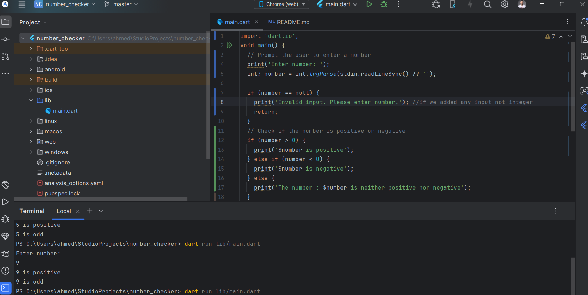

# number_checker

Dart project to check the input positive or negative number and even or odd number

## Getting Started

To execute the project you should run 'dart run lib/main.dart' without the quotation 
Then you will add the value you would like to check 

The output screenshot

